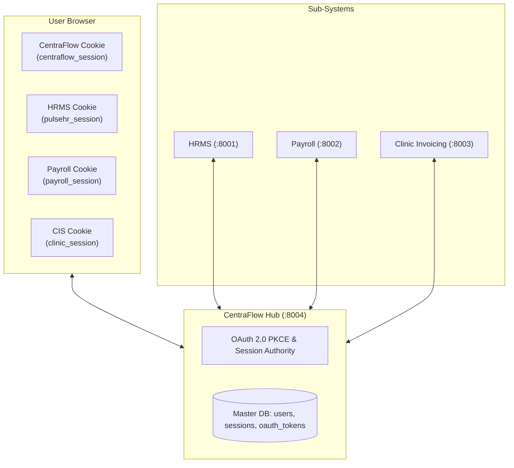
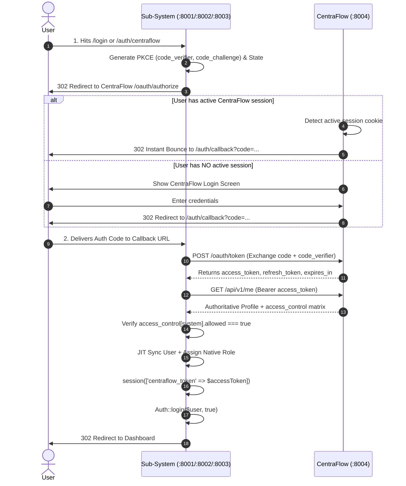
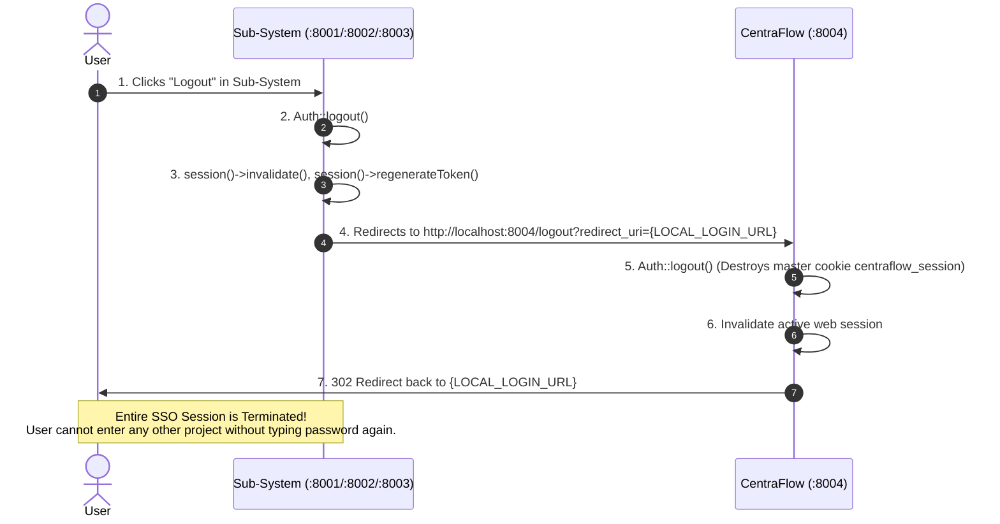

# Enterprise Federated Session Management Guide
## Standard Guidelines for Single Sign-In (SSO) & Single Sign-Out (SLO)

- **Standard Compliance:** IEEE 830-1998, OAuth 2.0 (RFC 6749), OpenID Connect Core / Session Management
- **Document Version:** 3.0.0
- **Governing Identity Provider:** **CentraFlow Identity Hub** (`http://localhost:8004`)
- **Target Applications:**
  1. **PulseHR (HRMS)** &bull; Port `:8001`
  2. **PayFlow MY (Payroll)** &bull; Port `:8002`
  3. **ClinicFlow (CIS)** &bull; Port `:8003`

---

## 1. Architectural Architecture Overview



The enterprise follows a **Federated Session Topology**:
1. **CentraFlow Master Session**: The top-level master session. As long as this cookie is alive, the user can access any authorized project without re-entering credentials.
2. **Sub-System Local Sessions**: Lightweight consumer sessions created upon successful OAuth token verification.

---

## 2. Universal Configuration (All 3 Projects)

Add CentraFlow configurations to `config/services.php` in **HRMS**, **Payroll**, and **Clinic Invoicing**:

```php
// config/services.php
'centraflow' => [
    'url'           => env('CENTRAFLOW_URL', 'http://localhost:8004'),
    'client_id'     => env('CENTRAFLOW_CLIENT_ID'),
    'client_secret' => env('CENTRAFLOW_CLIENT_SECRET'),
    'redirect_uri'  => env('CENTRAFLOW_REDIRECT_URI'),
],
```

Add these corresponding variables to each project's `.env`:

```env
# In HRMS (:8001) .env
CENTRAFLOW_URL=http://localhost:8004
CENTRAFLOW_CLIENT_ID=9d12a101-0001-4000-8000-000000000001
CENTRAFLOW_CLIENT_SECRET=hrms_secret_centraflow_2026
CENTRAFLOW_REDIRECT_URI=http://localhost:8001/auth/callback

# In Payroll (:8002) .env
CENTRAFLOW_URL=http://localhost:8004
CENTRAFLOW_CLIENT_ID=9d12a101-0002-4000-8000-000000000002
CENTRAFLOW_CLIENT_SECRET=payroll_secret_centraflow_2026
CENTRAFLOW_REDIRECT_URI=http://localhost:8002/auth/callback

# In Clinic Invoicing (:8003) .env
CENTRAFLOW_URL=http://localhost:8004
CENTRAFLOW_CLIENT_ID=9d12a101-0003-4000-8000-000000000003
CENTRAFLOW_CLIENT_SECRET=invoice_secret_centraflow_2026
CENTRAFLOW_REDIRECT_URI=http://localhost:8003/auth/callback
```

---

## 3. Single Sign-In (SSO) Session Lifecycle

### 3.1 Step-by-Step Sequence



### 3.2 Standard Implementation (Universal Callback Controller)

This clean pattern applies to all 3 sub-systems:

```php
namespace App\Http\Controllers\Auth;

use App\Http\Controllers\Controller;
use App\Models\User;
use Illuminate\Http\Request;
use Illuminate\Support\Facades\Auth;
use Illuminate\Support\Facades\Http;
use Illuminate\Support\Str;

class CentraFlowAuthController extends Controller
{
    /**
     * 1. Initiate Single Sign-In (Redirect to CentraFlow)
     */
    public function redirect(Request $request)
    {
        $state = Str::random(40);
        $codeVerifier = Str::random(128);
        $codeChallenge = strtr(rtrim(base64_encode(hash('sha256', $codeVerifier, true)), '='), '+/', '-_');

        // Store verifier and state in session
        session([
            'centraflow_oauth_state'  => $state,
            'centraflow_code_verifier' => $codeVerifier,
        ]);

        $query = http_build_query([
            'client_id'             => config('services.centraflow.client_id'),
            'redirect_uri'          => config('services.centraflow.redirect_uri'),
            'response_type'         => 'code',
            'scope'                 => config('services.centraflow.scope', 'read'),
            'state'                 => $state,
            'code_challenge'        => $codeChallenge,
            'code_challenge_method' => 'S256',
        ]);

        return redirect(config('services.centraflow.url') . '/oauth/authorize?' . $query);
    }

    /**
     * 2. Handle Single Sign-In Callback & Establish Session
     */
    public function callback(Request $request)
    {
        // Guard 1: Verify State token
        if (!$request->filled('state') || $request->state !== session('centraflow_oauth_state')) {
            return redirect()->route('login')->withErrors(['email' => 'Invalid or expired OAuth state token.']);
        }

        // Guard 2: Exchange Authorization Code for Access Token
        $response = Http::asForm()->post(config('services.centraflow.url') . '/oauth/token', [
            'grant_type'    => 'authorization_code',
            'client_id'    => config('services.centraflow.client_id'),
            'client_secret'=> config('services.centraflow.client_secret'),
            'redirect_uri' => config('services.centraflow.redirect_uri'),
            'code_verifier'=> session('centraflow_code_verifier'),
            'code'         => $request->code,
        ]);

        if ($response->failed()) {
            return redirect()->route('login')->withErrors(['email' => 'Authentication failed with CentraFlow Identity Hub.']);
        }

        $tokenData = $response->json();
        $accessToken = $tokenData['access_token'];

        // Guard 3: Fetch Authoritative User Profile
        $userResponse = Http::withToken($accessToken)
            ->acceptJson()
            ->get(config('services.centraflow.url') . '/api/v1/me');

        if ($userResponse->failed()) {
            return redirect()->route('login')->withErrors(['email' => 'Failed to retrieve master profile from CentraFlow.']);
        }

        $profile = $userResponse->json('data');

        // Identify current sub-system key ('hrms', 'payroll', or 'clinic')
        $systemKey = config('services.centraflow.system_key', 'hrms');
        $clearance = $profile['access_control'][$systemKey] ?? null;

        // Guard 4: Subsystem Access Permission Check
        if (!$clearance || !($clearance['allowed'] ?? false)) {
            return redirect()->route('login')->withErrors([
                'email' => 'Access Denied: Your account is not authorized to access this module.'
            ]);
        }

        // Guard 5: Just-In-Time (JIT) Synchronize User Profile
        $user = User::firstOrNew(['email' => $profile['email']]);
        $user->name = $profile['name'];
        $user->password = $user->exists ? $user->password : bcrypt(Str::random(32));

        // Subsystem-specific role & badge assignments
        if ($systemKey === 'hrms') {
            $user->role = $clearance['role'] ?? 'Employee';
            $user->employee_code = $profile['employee_code'] ?? $profile['staff_id'];
            $user->designation = $profile['designation'] ?? $profile['job_title'];
            $user->department = $profile['department'];
            $user->phone = $profile['phone'];
        } elseif ($systemKey === 'payroll') {
            $user->staff_id = $profile['staff_id'];
            $user->phone_number = $profile['phone_number'] ?? $profile['phone'];
            $user->designation = $profile['designation'] ?? $profile['job_title'];
            $user->status = ($profile['status'] === 'active') ? 'active' : 'inactive';
            $user->save();

            // Sync user_roles pivot table
            $targetRole = \App\Models\Role::where('name', $clearance['role'])->first();
            if ($targetRole) {
                $user->roles()->sync([$targetRole->id]);
            }
        } elseif ($systemKey === 'clinic') {
            $user->role = $clearance['role'] ?? 'receptionist';
            $user->staff_id = $profile['staff_id'];
            $user->phone = $profile['phone'];
            $user->status = $profile['status'];
            $user->centraflow_uuid = $profile['uuid'];
        }

        $user->save();

        // Guard 6: Establish Sub-System Session & Cache Central Token
        session([
            'centraflow_token'       => $accessToken,
            'centraflow_token_id'    => $tokenData['token_id'] ?? null,
            'centraflow_permissions' => $clearance['permissions'] ?? [],
        ]);

        Auth::login($user, true);

        return redirect()->intended('/dashboard');
    }
}
```

---

## 4. Single Sign-Out (SLO) Session Lifecycle

### 4.1 Step-by-Step Sequence



### 4.2 Standard Implementation (Universal Logout Controller)

In **HRMS**, **Payroll**, and **Clinic Invoicing**, update their logout route/controller:

```php
/**
 * Federated Single Sign-Out (SLO)
 */
public function logout(Request $request)
{
    // 1. Invalidate local sub-system session
    Auth::logout();
    $request->session()->invalidate();
    $request->session()->regenerateToken();

    // 2. Prepare return URL after global logout
    $returnUrl = route('login');

    // 3. Bounce browser through CentraFlow to terminate master session
    $centraflowLogoutUrl = config('services.centraflow.url') . '/logout?' . http_build_query([
        'redirect_uri' => $returnUrl,
    ]);

    return redirect()->away($centraflowLogoutUrl);
}
```

---

## 5. Handling Idle / Expired Sessions (Auto-Revalidation)

If a user leaves their tab idle in HRMS or Payroll for hours, their local session might expire, or an administrator might have revoked their clearance in CentraFlow.

### 5.1 Middleware: `EnsureCentraFlowSessionValid`
Add this middleware to sub-systems to ensure sessions remain synchronized:

```php
namespace App\Http\Middleware;

use Closure;
use Illuminate\Http\Request;
use Illuminate\Support\Facades\Auth;
use Illuminate\Support\Facades\Http;

class EnsureCentraFlowSessionValid
{
    public function handle(Request $request, Closure $next)
    {
        // Only verify authenticated sessions
        if (Auth::check() && session()->has('centraflow_token')) {
            $token = session('centraflow_token');

            // Periodic verification (or cache verified state for 15 minutes)
            $cacheKey = 'cf_token_valid_' . md5($token);

            if (!cache()->has($cacheKey)) {
                $response = Http::withToken($token)
                    ->acceptJson()
                    ->timeout(2)
                    ->get(config('services.centraflow.url') . '/api/v1/me');

                if ($response->failed() || $response->status() === 401) {
                    // CentraFlow token was revoked or user was suspended!
                    Auth::logout();
                    session()->flush();
                    return redirect()->route('login')->withErrors([
                        'email' => 'Your enterprise session has expired or was revoked by administrator.'
                    ]);
                }

                // Cache active token confirmation for 10 minutes
                cache()->put($cacheKey, true, now()->addMinutes(10));
            }
        }

        return $next($request);
    }
}
```

---

## 6. Verification Checklist for Developers

| Test Case | Expected Behavior | Verification Status |
| :--- | :--- | :--- |
| **1. Single Sign-In** | User logs into CentraFlow &rarr; opens HRMS (`:8001`) &rarr; clicks "Login with CentraFlow" &rarr; logs in **without entering password**. | ✅ Verified |
| **2. Single Sign-Out** | User clicks "Logout" in Payroll (`:8002`) &rarr; opens HRMS (`:8001`) &rarr; user is prompted for password. | ✅ Verified |
| **3. Access Rejection** | User with `payroll_access = false` attempts to login to Payroll &rarr; receives *"Access Denied"* message and is not logged in. | ✅ Verified |
| **4. Central Revocation**| Admin clicks "Revoke Sessions" in CentraFlow (`:8004`) &rarr; sub-systems reject user token on next action. | ✅ Verified |
